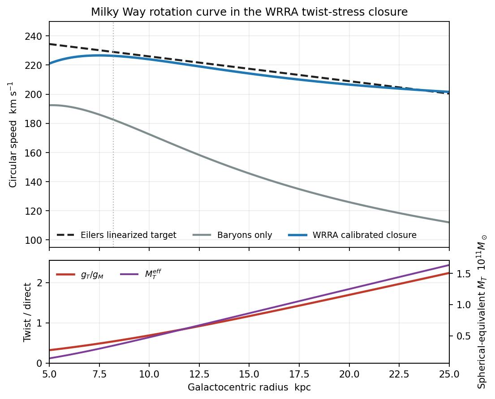
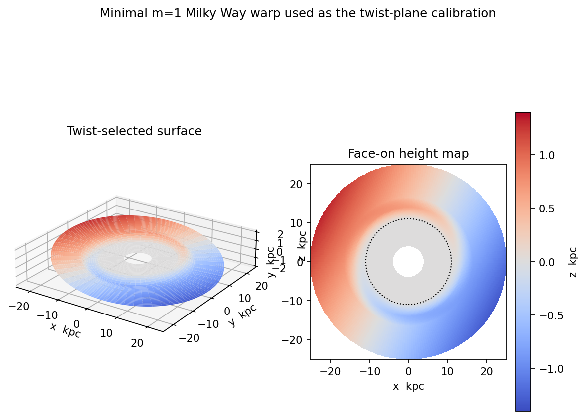

# WRRA Spatial Twist, Galactic Disk Planes, and the Dark-Mass Phenotype

**Author:** Wonsik Choi  
**Version:** 1.0 (2026-09-28)  
**Status:** Quantitative toy model and falsifiable WRRA hypothesis

This repository contains the Korean and English editions of a WRRA model for the Milky Way disk. Its central distinction is:

> **Twist selects the plane but does not define angular momentum.**

The directional sector of the twist state selects an **unoriented local plane**—the normals **n** and **−n** represent the same plane—without introducing a prior global “up” or “down.” Angular momentum remains a separate physical quantity that maintains rotation in the selected plane. A magnitude sector of the same state is modeled as spatial stress and appears gravitationally as an effective dark-mass phenotype.

## Papers

| Language | PDF | Editable DOCX |
|---|---|---|
| English | [WRRA_Galactic_Disk_EN.pdf](papers/WRRA_Galactic_Disk_EN.pdf) | [WRRA_Galactic_Disk_EN.docx](papers/WRRA_Galactic_Disk_EN.docx) |
| 한국어 | [WRRA_Galactic_Disk_KO.pdf](papers/WRRA_Galactic_Disk_KO.pdf) | [WRRA_Galactic_Disk_KO.docx](papers/WRRA_Galactic_Disk_KO.docx) |

## Evaluation structure

### 1. Validation inputs

- Milky Way baryonic components based on the McMillan mass model
- A fixed WRRA transition scale, `a_T = 1.1918 × 10^-10 m s^-2`
- A SPARC-calibrated constitutive response, frozen before the Milky Way calculation
- A linearized Eilers et al. rotation-curve target
- Gaia DR3 Cepheid constraints for the warp onset, inclination, and line of nodes

### 2. WRRA-specific transformation

The minimal twist state is

```text
T = ([n], rho_T, q_T)
```

where `[n]` is an unoriented plane director, `rho_T` is the stress-energy magnitude sector, and `q_T` represents anisotropic response. The model transforms this state into a disk-plane field, an additional gravitational acceleration, and a vertical restoring sector. It does not identify `[n]` with angular momentum.

### 3. Outputs

- Circular speed at `R = 8.2 kpc`: **226.3 km/s**
- Circular speed at `R = 25 kpc`: **201.6 km/s**
- RMS difference from the linearized Eilers target over `8–25 kpc`: **2.42 km/s**
- Minimal warp: onset near **11 kpc**, reaching an outer inclination of about **3°**





### 4. Falsification conditions

The hypothesis is weakened or falsified if, after the rotation sector fixes the additional gravitational field:

- the same twist state cannot reproduce vertical velocity dispersion, disk thickness, or outer-disk flaring;
- the effective stress cannot reproduce gravitational lensing through the same metric;
- one evolving plane field cannot connect the stellar, HI, and H2 mean planes and vertical motions;
- galaxy-by-galaxy free refitting of `a_T` or the constitutive response is required; or
- systems such as polar-ring galaxies require arbitrary unrelated planes rather than a viable local plane field.

## Conclusion and claim boundary

The calculation closes a first quantitative toy model in which disk geometry and additional gravity are distinct outputs of one WRRA twist state. It does **not** yet establish the physical origin of the twist field. In particular, the anisotropic constitutive relation for `q_T`, the vertical-frequency calculation, a covariant action, and joint kinematic/lensing tests remain open.

## Reproduction

Python 3.11 or later is recommended.

```bash
python -m venv .venv
source .venv/bin/activate
pip install -r requirements.txt
python build_wrra_milkyway_paper.py
python translate_wrra_paper_en.py
```

The build script writes figures, equation images, and the Korean DOCX under `output/`. The translation script then creates the English DOCX. PDF files in `papers/` are the typeset release artifacts.

## 한국어 요약

이 저장소의 핵심 명제는 **“뒤틀림은 원반의 평면을 선택하지만 각운동량을 정의하지 않는다”**입니다. 부호가 없는 평면 방향자 `[n]`은 3차원 공간에서 국소적인 2차원 수송면을 정하되 상하나 회전 방향을 미리 정하지 않습니다. 각운동량은 선택된 평면 안의 회전을 유지하는 별도의 물리량입니다. 같은 뒤틀림 상태의 크기 성분은 공간 응력으로 모델링되며, 추가 중력 또는 유효 암흑질량 표현형으로 나타납니다.

우리은하 시험 모형은 태양 반경에서 226.3 km/s, 25 kpc에서 201.6 km/s를 산출하고, 8–25 kpc 구간에서 선형화된 관측 목표와 2.42 km/s의 RMS 차이를 보입니다. 다만 이는 뒤틀림의 물리적 기원을 입증한 것이 아니라, 하나의 뒤틀림 상태가 원반 형상과 추가 중력을 서로 다른 산출값으로 낼 수 있음을 보인 첫 정량적 폐쇄 모형입니다.

## Copyright

Copyright © 2026 Wonsik Choi. All rights reserved. See [COPYRIGHT.md](COPYRIGHT.md).
